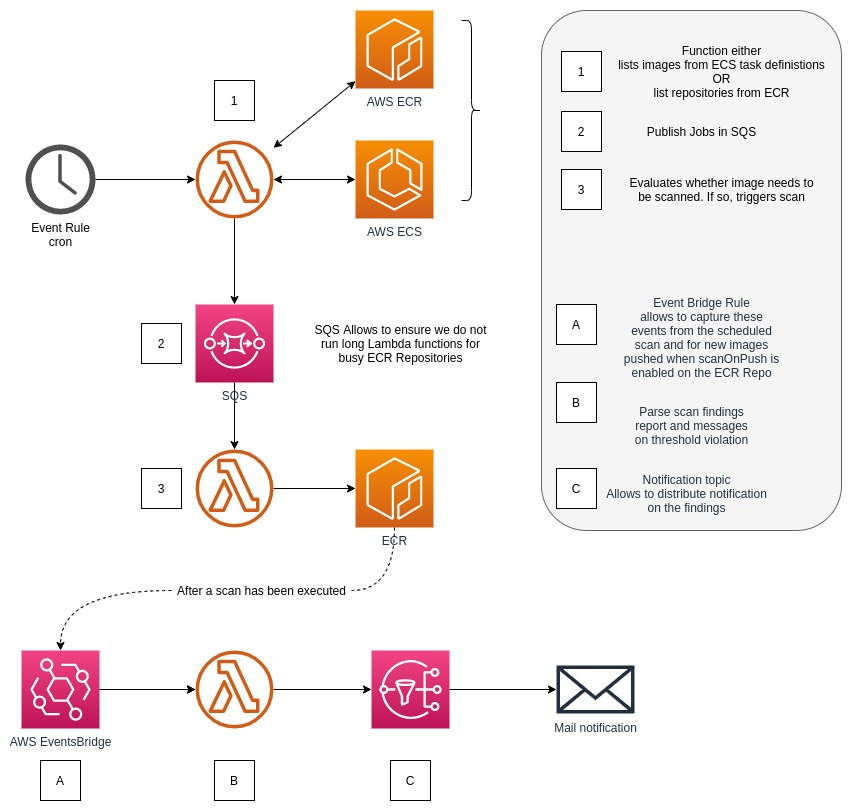

.. _workflow:

==========
Workflow
==========

=======================
The Lambda Functions
=======================

repositoriesScannerFunction
============================

This function is here to trigger the others, based on a schedule. Enabling this function on a regular basis,
to list repositories and consequently trigger the next function, `imagesScannerFunction`_, allows you to stay on top
of the ECR Security Findings as AWS updates their scanner CVE database.

That aims to provide confidence that no major security vulnerability that is present due to the OS or packages will
go un-noticed for too long and take early actions.

Configuration
-----------------

Rate
+++++

Through AWS CFN, you can adapt the rate at which you wish to trigger this Function.
The current rate is based on the `AWS EventsBridge Rate Expressions`_.

.. hint::

    Default is set to *1 day*

Repositories Filter
+++++++++++++++++++++

In case you implemented a naming convention to have categories of repositories or any sort of logic you might have in
your ECR Repos, this allows you to whitelist which repositories you want to perform the scans on based on a regular expression.

.. hint::

    You can define it to your lambda function by setting the env var **REPOSITORIES_FILTER_REGEXP**

Logic
-------

This function is simply going to list all of the repositories in your account (based on the region the lambda has been deployed)
and will send a small message into AWS SQS with all the repositories to process.

The reason for it is simply to parallelize the images scanning, and do a shoot and forget. It also allows to keep it
very fast and efficient, and in the future add features without changing the logic of other functions.

imagesScannerFunction
==========================

This function is in charge of reviewing the images in for a given repository.
Based on whether the image (digest or tag) has been scanned recently or not, it will trigger for a new scan to start.

Configuration
---------------

Scan "expiration period"
+++++++++++++++++++++++++

This allows you to define how long ago the last scan has been done, since the lambda is running.
For example, if you set the value to 1 month, the lambda will retrieve the last scan date, and if it was over a month ago,
will trigger for a new scan.

The expiration duration can be defined in montns, weeks or days.

.. code-block:: python

    r"(?P<months>\dm)?(?P<weeks>\dw)?(?P<days>\dd)?"

.. hint::

    The default duration is set to 7d (7 days)

.. hint::

    You can define it to your lambda function by setting the env var **ECR_IMAGES_DURATION_DELTA**

Logic
---------

This function is by default allowed to run longer than the others, mostly in case you hit the ECR API limit, so it will
pause without retry the Lambda execution itself.

It will list all the images in the repository and describe each of them to retrieve more details about each of them,
to evaluate whether a scan is due or not.

reporterFunction
=================

Last but not least, this is a very simple function that allows you to get notifications about security findings sent to
AWS SNS. By default from the AWS SAR template, you can define an email address that will subscribe to the notifications.

The events are captured directly from EventsBridge, meaning that it will run completely independently to the other functions.
If you created your ECR repositories with scanOnPush set to true, which triggers a scan each new push, that will allow
you to get the notification moments after image build without having to go to the ECR console to check.

.. _AWS EventsBridge Rate Expressions: https://docs.aws.amazon.com/eventbridge/latest/userguide/eb-create-rule-schedule.html#eb-rate-expressions
